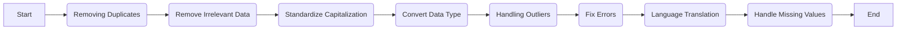

## Steps Involved in Data Cleaning Process

1. **Removing Duplicates:**

   - **Identification:** Identify duplicate records by comparing rows in the dataset.
   - **Elimination:** Remove duplicate entries to avoid redundancy and maintain data accuracy.

2. **Remove Irrelevant Data:**

   - **Data Relevance:** Evaluate the significance of each data column for the analysis.
   - **Elimination Criteria:** Remove columns that do not contribute to the research objectives.

3. **Standardize Capitalization:**

   - **Consistency:** Ensure uniformity in text data by standardizing the capitalization format.
   - **Normalization:** Normalize text fields to enhance data consistency and readability.

4. **Convert Data Type:**

   - **Data Transformation:** Convert data types to the appropriate format for analysis.
   - **Validation:** Validate data conversions to prevent errors in subsequent analyses.

5. **Handling Outliers:**

   - **Identification:** Detect outliers using statistical methods or visualization techniques.
   - **Treatment:** Decide whether to remove outliers, cap them, or transform them based on the analysis requirements.

6. **Fix Errors:**

   - **Error Detection:** Identify and rectify errors such as typos, formatting inconsistencies, or incorrect values.
   - **Data Integrity:** Ensure data integrity by correcting errors that could impact the analysis results.

7. **Language Translation:**

   - **Multilingual Data:** Translate data into a common language for uniformity and ease of analysis.
   - **Cross-Cultural Analysis:** Facilitate cross-cultural analysis by translating data accurately.

8. **Handle Missing Values:**
   - **Missing Data Identification:** Identify missing values in the dataset.
   - **Imputation:** Impute missing values using methods like mean, median, or predictive modeling to maintain data completeness.

## Data Cleaning Process Diagram

The data cleaning process involves a meticulous approach to ensure data quality, consistency, and accuracy, laying the foundation for robust data analysis and decision-making. Each step in the process is essential for preparing the data for meaningful insights and actionable outcomes.
